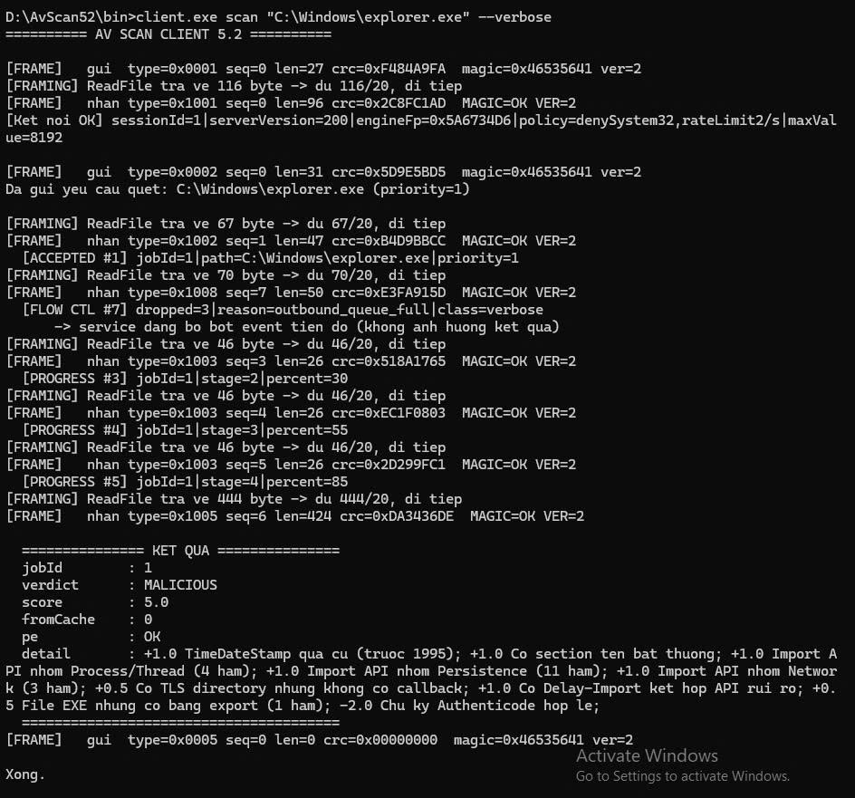
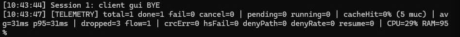
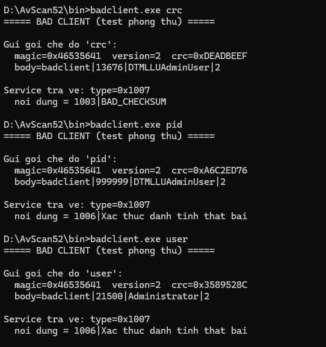
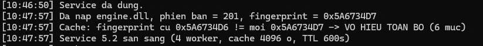
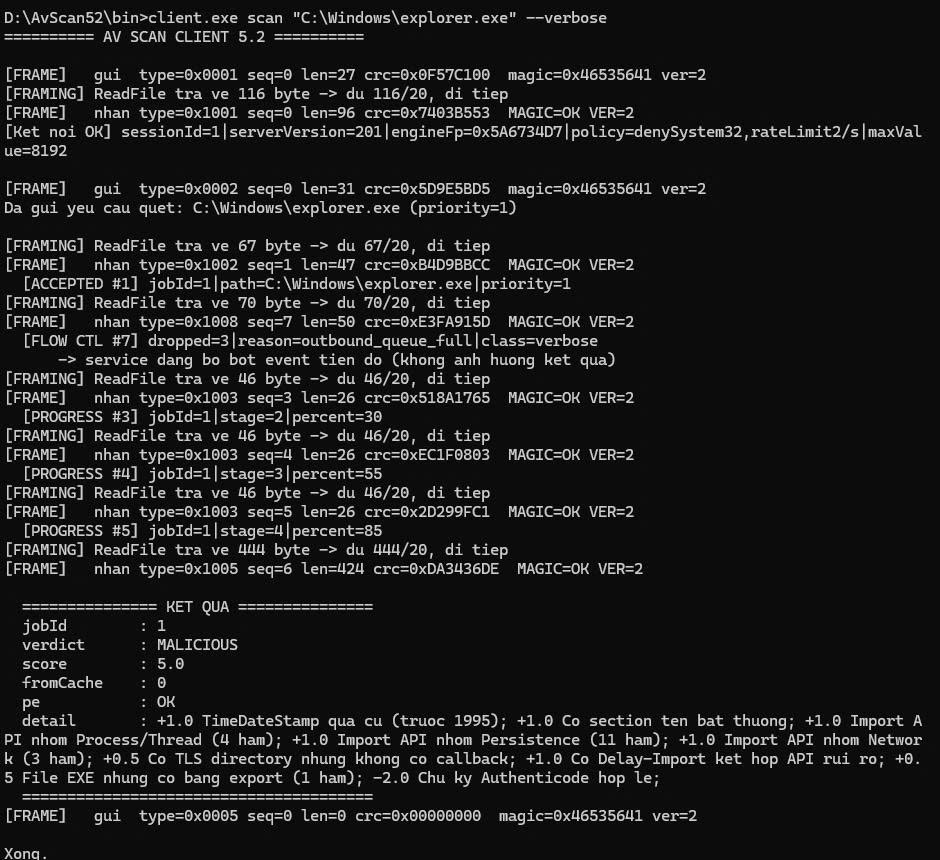
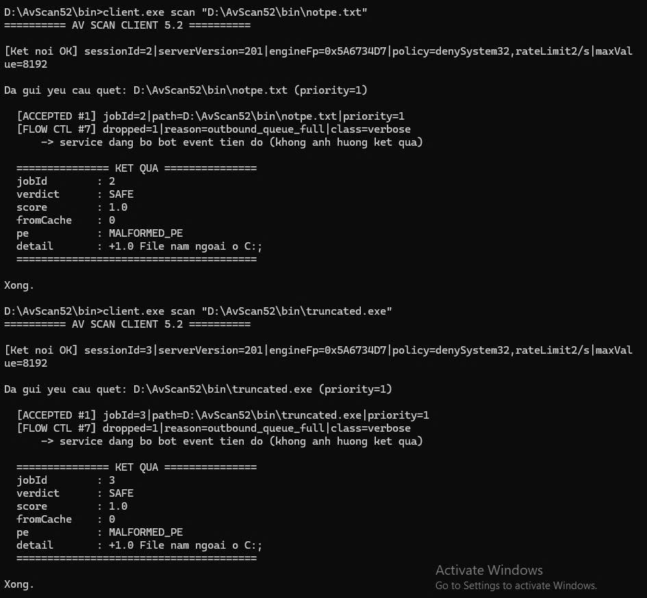

# AvScan — Hệ thống quét file kiểu Antivirus (Bài 5.1 & 5.2)

Service + Engine DLL + Client giao tiếp qua Windows Named Pipe.
Viết bằng C thuần, Win32 API, build bằng Visual Studio 2022 (x64).

---

## Mục lục

- [Kiến trúc](#kiến-trúc)
- [Bài 5.1 — Nền tảng](#bài-51--nền-tảng)
- [Bài 5.2 — Nâng cấp](#bài-52--nâng-cấp)
- [Build](#build)
- [Chạy](#chạy)
- [Demo](#demo)
- [Cấu hình](#cấu-hình)
- [Hạn chế đã biết](#hạn-chế-đã-biết)

---

## Kiến trúc

```
client.exe ──Named Pipe──► service.exe ──LoadLibrary──► engine.dll
           (2 process,                  (cùng process,
            byte thô qua kernel)         con trỏ hàm)
```

| Thành phần | Vai trò | Vòng đời |
|---|---|---|
| `engine.dll` | Phân tích file, chấm điểm | Nạp/gỡ theo lệnh |
| `service.exe` | Hàng đợi, worker pool, cache, throttle | Chạy 24/7 |
| `client.exe` | CLI, hiển thị streaming | Vài giây |

**Tách ba thành phần** vì mỗi phần có nhịp thay đổi khác nhau: engine cập nhật hằng ngày, service vài tháng một lần, client có thể thay bằng GUI.

---

## Bài 5.1 — Nền tảng

| Module | Nội dung |
|---|---|
| Engine DLL | 4 hàm export, nạp động bằng `LoadLibrary` + `GetProcAddress` |
| Pipe Server | Named Pipe + giao thức TLV, mỗi client một luồng |
| Job Queue | Producer–Consumer, 4 worker, Semaphore + Mutex |
| Throttle | Đo CPU/RAM, máy trạng thái IDLE / BUSY / OVERLOADED |
| Cache | Key `path + lastWriteTime + size`, TTL 10 phút |
| Telemetry | 8 chỉ số, ghi log ra file |
| Vận hành | Console mode và Windows Service, một file 7 vai trò |

---

## Bài 5.2 — Nâng cấp

### Phần 1 — Giao thức pipe

| Hạng mục | 5.1 | 5.2 |
|---|---|---|
| Header khung tin | 6 byte (TLV) | **20 byte**: magic + version + type + seq + length + CRC32 |
| Xử lý đọc | `if (read != cần) return FALSE;` | `while (đang_có < cần) { đọc thêm; }` |
| Gửi tin | Worker tự `WriteFile` | **Outbound queue + SenderThread riêng mỗi session** |
| Mất kết nối | Xóa sạch | Giữ session 10 giây, hỗ trợ `RESUME {sessionId, lastEventSeq}` |
| Bảo mật pipe | `DACL = NULL` (mở cho tất cả) | **SDDL**: chỉ SYSTEM + Administrators + Interactive Users |
| Danh tính client | Tin lời khai | Kiểm PID qua kernel + user qua **impersonation** |
| Policy | Không có | Deny-list (chống path traversal) + rate limit (token bucket) |

### Phần 2 — Cache

| | 5.1 | 5.2 |
|---|---|---|
| Cấu trúc | Mảng 256, tìm tuyến tính O(n) | **Hash table 4096, O(1)** |
| Vòng đời | Mất khi restart | **Ghi ra file, nạp lại lúc khởi động** |
| Update engine | Kết quả cũ vẫn được dùng → **malware lọt lưới** | **Engine fingerprint** trong cache key, vô hiệu 2 tầng |

### Phần 3 — PE Parser

Module `pereader.c` tự parse PE **không dùng Windows API**:

- DOS header → NT headers → Optional header → DataDirectory → Section table
- Phân biệt PE32 (`0x10B`) và PE32+ (`0x20B`)
- Hàm `RvaToFileOffset()` dịch địa chỉ RAM sang vị trí file
- Trả `MALFORMED_PE` / `STRUCT_CORRUPT` cho file hỏng
- 11 thông số: machine, subsystem, isDll, isDriver, isManaged, isSigned, hasDebug, hasRichHeader, entryPointRva, imageBase, sectionCount
- 5 nhóm rule A–E, điểm số thực (`double`)
- Nhóm E dùng **`WinVerifyTrust` thật**: SIGNED_VALID / SIGNED_INVALID / UNSIGNED

---

## Build

### Cấu trúc thư mục

```
D:\AvScan52\
├── src\          9 file mã nguồn
├── bin\          engine.dll, service.exe, client.exe
├── engine\       project VS
├── service\      project VS
└── client\       project VS
```

> Đường dẫn phải **thuần ASCII, không dấu tiếng Việt**. Ký tự ngoài ASCII làm hỏng `BINARY_PATH_NAME` khi đăng ký service.

### File cho từng project

| Project | File `.c` | Cấu hình đặc biệt |
|---|---|---|
| `engine` | `engine.c`, `pereader.c` | Configuration Type = **Dynamic Library (.dll)** |
| `service` | `service.c`, `framing.c`, `pereader.c` | — |
| `client` | `client.c`, `framing.c` | — |

Cả ba project:
- **Platform**: x64
- **Output Directory**: `D:\AvScan52\bin\`
- **Additional Include Directories**: `D:\AvScan52\src`

`wintrust.lib` và `crypt32.lib` được link tự động qua `#pragma comment(lib, ...)` trong `engine.c`.

---

## Chạy

Toàn bộ demo chạy ở **chế độ Windows Service**.

### Ba cửa sổ làm việc

| Cửa sổ | Loại | Dùng để |
|---|---|---|
| **1** | cmd **quyền Admin** | `service.exe install/start/stop/status` |
| **2** | PowerShell | Theo dõi log thời gian thực |
| **3** | cmd **thường** | Chạy `client.exe`, `badclient.exe` |

### Cửa sổ 1 — Cài đặt và khởi động

```cmd
cd /d D:\AvScan52\bin
service.exe install
service.exe start
service.exe status
```

Phải thấy `Trang thai: RUNNING   (PID = ...)`.

### Cửa sổ 2 — Theo dõi log

```powershell
cd D:\AvScan52\bin
Get-Content service52.log -Wait -Tail 30
```

> **Vì sao bắt buộc đọc log qua file:** Windows Service chạy trong **Session 0** — phiên riêng không gắn với màn hình nào. Mọi `printf` bay vào hư vô. Đây là lý do `LogMsg` luôn ghi ra file.

### Cửa sổ 3 — Client

```cmd
cd /d D:\AvScan52\bin
client.exe scan "C:\Windows\explorer.exe" [--priority high|normal|low] [--verbose]
client.exe query <jobId>
client.exe cancel <jobId>
```

> Client chạy **quyền thường** là có chủ ý. Service chạy dưới `LocalSystem`, client chạy dưới tài khoản người dùng — chênh lệch này để demo cơ chế impersonation ở Demo 2.

### Dừng và gỡ

```cmd
service.exe stop
service.exe uninstall
```

---

## Demo

Bốn demo phủ 15/23 yêu cầu của đề bài.

### Chuẩn bị

**Cửa sổ 1:**
```cmd
service.exe stop
del D:\AvScan52\bin\cache52.bin
service.exe start
```

Cấu hình trong `service.c` khi demo:
```c
#define OUTQ_SIZE        4      /* giá trị thật: 128 */
#define SENDER_DELAY_MS  400    /* giá trị thật: 0   */
```

> Hai giá trị này tái tạo điều kiện client chậm không đọc pipe. Với giá trị thật, hàng đợi 128 ô không bao giờ đầy vì một lần quét chỉ sinh 8 sự kiện. **Cơ chế xử lý là cơ chế thật**, chỉ điều kiện là mô phỏng.

---

### Demo 1 — Framing và Backpressure

**Phủ yêu cầu:** 1.1 (magic + version + length + checksum), 1.3 (sticky packet), 1.5–1.7 (outbound queue, drop verbose, FLOW_CONTROL)

**Cửa sổ 3:**
```cmd
client.exe scan "C:\Windows\explorer.exe" --verbose
```



**Giải thích:**

`magic=0x46535641` — tách byte ra là `F S V A`, little-endian đọc thành **`AVSF`**. Cùng với `ver=2`, `len=27`, `crc=0xF484A9FA` là đủ 4 trường đề bài yêu cầu. Dòng `nhan` có `MAGIC=OK VER=2` chứng tỏ bên nhận thực sự kiểm tra chứ không bỏ qua.

Các dòng `[FRAMING] ReadFile tra ve 116 byte -> du 116/20` cho thấy **sticky packet**: một lần đọc mang về nhiều hơn số byte cần cho một khung tin. Bài 5.1 giả định một lần đọc = một tin nên sẽ **vứt mất** phần dư.

`[FLOW CTL #7] dropped=3` — hàng đợi gửi đầy, 3 sự kiện verbose bị bỏ nhưng `KET QUA` vẫn đến đủ.

Điểm đáng chú ý nhất: dãy seq nhận được là **`1, 7, 3, 4, 5, 6`** — thiếu số 2. Sự kiện `PROGRESS stage 1` đã được cấp seq và đã vào hàng đợi, rồi **bị đẩy ra** để nhường chỗ cho tin critical. Lỗ hổng số thứ tự này chứng minh service **chủ động hy sinh** tin tiến độ để cứu tin kết quả, chứ không chỉ từ chối tin mới đến.

---



**Giải thích:**

`done=1` — job hoàn thành bình thường **dù luồng gửi bị làm chậm 400ms mỗi tin**.

Ở bài 5.1, tình huống client chậm làm **cả 4 worker treo cứng** tại `WriteFile`: `running=4` vĩnh viễn, `done` đứng im. Bài 5.2 worker chỉ gọi `SessionPush` (vài micro-giây) rồi đi tiếp, **không bao giờ chạm vào pipe**. Đây là thay đổi kiến trúc quan trọng nhất của bài.

Lưu ý phân biệt: `dropped=3` là bỏ 3 **tin nhắn**, không phải 3 job. `cancel=0` mới là số job bị hủy.

---

### Demo 2 — Ba lớp phòng thủ

**Phủ yêu cầu:** 1.4 (checksum fail → lỗi chuẩn hóa), 1.10 (PID tồn tại + user khớp token)

**Cửa sổ 3:**
```cmd
badclient.exe crc
badclient.exe pid
badclient.exe user
```



**Giải thích:**

Ba gói giả mạo, ba kết quả từ chối:

| Lệnh | Gói gửi đi | Service trả về |
|---|---|---|
| `crc` | `crc=0xDEADBEEF` (sai cố ý) | `1003\|BAD_CHECKSUM` |
| `pid` | `body=badclient\|999999\|...` (PID không tồn tại) | `1006\|Xac thuc danh tinh that bai` |
| `user` | `body=badclient\|21500\|Administrator\|2` (user giả) | `1006\|Xac thuc danh tinh that bai` |

Mã lỗi là **số cố định** định nghĩa trong `protocol.h`, không phải câu chữ tự do — client xử lý bằng `switch (code)` chứ không so sánh chuỗi tiếng Anh.

Lệnh `pid` có checksum **đúng** (`crc=0xA6C2ED76`) nhưng vẫn bị chặn ở tầng xác thực. PID lấy từ `GetNamedPipeClientProcessId` — **kernel trả lời**, client không can thiệp được. User lấy qua `ImpersonateNamedPipeClient`: service tạm "khoác áo" client để hỏi kernel client thực sự là ai, rồi `RevertToSelf` cởi ra.

Hai lệnh `pid` và `user` trả **cùng mã 1006** — chủ ý bảo mật, không cho kẻ tấn công dò từng phần bằng cách xem thông báo lỗi đổi hay không. Chi tiết chỉ nằm trong log phía service:

```
Handshake: PID khai 999999 != PID that 13676 -> TU CHOI
Handshake: user khai 'Administrator' != user that 'DTMLLUAdminUser' -> TU CHOI
```

Demo này ở chế độ Windows Service thuyết phục hơn console: service chạy dưới `LocalSystem` nhưng impersonation lấy ra tên người dùng thật, chứng minh cơ chế hoạt động.

---

### Demo 3 — Cache: xử lý update engine

**Phủ yêu cầu:** 2.1 (fast path), 2.2 (persistent), 2.3 (xử lý update engine)

Đây là demo quan trọng nhất của Phần 2 — nó chống một **lỗ hổng bảo mật thật**.

**Bước 1 — Fast path. Cửa sổ 3:**
```cmd
client.exe scan "C:\Windows\notepad.exe" --verbose
client.exe scan "C:\Windows\notepad.exe" --verbose
```

**Bước 2 — Bền vững qua restart. Cửa sổ 1:**
```cmd
service.exe stop
service.exe start
```

**Bước 3 — Update engine. Cửa sổ 1:**
```cmd
service.exe stop
```

Sửa `engineapi.h`: `ENGINE_VERSION_MINOR` từ `0` thành `1`, build lại project `engine`.

```cmd
service.exe start
```



**Giải thích:**

Ba dòng log kể trọn câu chuyện:

```
Da nap engine.dll, phien ban = 201, fingerprint = 0x5A6734D7
Cache: fingerprint cu 0x5A6734D6 != moi 0x5A6734D7 -> VO HIEU TOAN BO (6 muc)
Service 5.2 san sang (4 worker, cache 4096 o, TTL 600s)
```

`phien ban = 201` — engine mới đã được nạp (trước đó là 200).

`fingerprint cu 0x5A6734D6 != moi 0x5A6734D7` — hệ thống **tự phát hiện** engine đã đổi, chênh nhau đúng 1 ở byte cuối vì chỉ tăng `ENGINE_VERSION_MINOR`.

`VO HIEU TOAN BO (6 muc)` — 6 mục cache cũ bị xóa sạch, không mục nào được tin dùng lại.

Kịch bản lỗ hổng nếu không có cơ chế này:

```
Ngày 1: engine 1.0 quét abc.exe → SAFE, lưu cache
Ngày 2: nâng lên engine 2.0 có rule mới phát hiện TLS callback
        abc.exe CÓ TLS callback → lẽ ra phải là MALICIOUS
Ngày 2: quét lại → file không đổi → CACHE HIT → trả về SAFE
        ENGINE MỚI KHÔNG BAO GIỜ ĐƯỢC GỌI
```

**Malware lọt lưới vì cache.** Fingerprint băm cả số phiên bản lẫn các ngưỡng chấm điểm, nên chỉnh ngưỡng mà quên tăng version vẫn bị phát hiện.

---

**Kiểm chứng phía client. Cửa sổ 3:**
```cmd
client.exe scan "C:\Windows\explorer.exe" --verbose
```



**Giải thích:**

`serverVersion=201` và `engineFp=0x5A6734D7` trong dòng `[Ket noi OK]` — client nhận được thông tin engine mới ngay từ tin `WELCOME`.

`fromCache=0` — file này **đã từng được quét** trước khi update engine, nhưng cache không còn dùng được. Engine mới chạy lại từ đầu, đủ 5 giai đoạn.

Đây là bằng chứng khép kín: cache bị vô hiệu ở phía service (ảnh trên) và engine mới thực sự được gọi ở phía client (ảnh này).

> Sau demo, đổi `ENGINE_VERSION_MINOR` về `0` và build lại.

---

### Demo 4 — PE parser và chữ ký số

**Phủ yêu cầu:** 3.4 (MALFORMED_PE / STRUCT_CORRUPT), 3.5 (11 thông số), 3.6 (nhóm rule A–D), 3.7 (WinVerifyTrust), 3.8 (điểm số thực)

**Cửa sổ 3:**
```cmd
client.exe scan "C:\Windows\explorer.exe" --verbose
```


**Giải thích:**

Khối `detail` cho thấy kết quả chấm điểm:

```
+1.0 TimeDateStamp qua cu (truoc 1995);          <- nhóm A
+1.0 Co section ten bat thuong;                   <- nhóm B
+1.0 Import API nhom Process/Thread (4 ham);      <- nhóm C
+1.0 Import API nhom Persistence (11 ham);        <- nhóm C
+1.0 Import API nhom Network (3 ham);             <- nhóm C
+0.5 Co TLS directory nhung khong co callback;    <- nhóm C
+1.0 Co Delay-Import ket hop API rui ro;          <- nhóm C
+0.5 File EXE nhung co bang export (1 ham);       <- nhóm C
-2.0 Chu ky Authenticode hop le;                  <- nhóm E
```

Bốn nhóm rule cùng kích hoạt trên một file.

Điểm **`+0.5`** và **`-2.0`** buộc `score` phải là kiểu `double`. Bài 5.1 chỉ dùng `int`.

Dòng `-2.0 Chu ky Authenticode hop le` là kết quả `WinVerifyTrust` thật với `WINTRUST_ACTION_GENERIC_VERIFY_V2`, kiểm được cả chuỗi chứng chỉ — không chỉ xem DataDirectory[4] có khác 0 hay không.

Toàn bộ thông số parse **bằng tay từ byte thô**, không dùng `ImageNtHeader()`. Lý do: Windows API từ chối file PE hỏng — mà file hỏng chính là thứ cần phát hiện. Ngoài ra `LoadLibraryEx` có thể **thực thi code** trong file, cực nguy hiểm khi quét malware.

> **Lưu ý về ảnh trên:** không thấy dòng `[PE INFO]` chứa 11 thông số PE vì nó thuộc lớp verbose và đã bị bỏ khi hàng đợi đầy (`dropped=3`) — chính là hiện tượng backpressure ở Demo 1. Xem mục [Ảnh còn thiếu](#ảnh-còn-thiếu) để biết cách chụp dòng đó.

---

**Tạo file PE hỏng** — mở PowerShell mới (không phải cửa sổ 2):

```powershell
cd D:\AvScan52\bin
"hello" | Out-File -Encoding ascii notpe.txt
$b = [System.IO.File]::ReadAllBytes("C:\Windows\explorer.exe")
[System.IO.File]::WriteAllBytes("D:\AvScan52\bin\truncated.exe", $b[0..199])
```

**Cửa sổ 3:**
```cmd
client.exe scan "D:\AvScan52\bin\notpe.txt"
client.exe scan "D:\AvScan52\bin\truncated.exe"
```



**Giải thích:**

Cả hai file đều bị `PeRead()` từ chối và trả `pe : MALFORMED_PE`:

| File | Lý do bị từ chối |
|---|---|
| `notpe.txt` | Thiếu chữ ký `MZ` ở offset 0 |
| `truncated.exe` | Có `MZ` nhưng `e_lfanew` trỏ ra ngoài file (chỉ 200 byte) |

Windows API sẽ từ chối cả hai mà **không cho biết lý do**. Code tự parse phân biệt được hai loại lỗi:

| Mã | Nghĩa | Mức đáng ngờ |
|---|---|---|
| `MALFORMED_PE` | Không phải PE, thiếu chữ ký, file quá ngắn | Thấp — thường là file bình thường (ảnh, văn bản) |
| `STRUCT_CORRUPT` | **Đúng là PE** nhưng số liệu vô lý (section vượt file, RVA out of range) | Cao — file **cố tỏ ra là PE** nhưng cấu trúc sai |

Khác biệt về cách xử lý điểm cũng phản ánh điều đó (`engine.c` dòng 521–543):

```c
if (st == PE_MALFORMED_PE) {
    RuleNonPe(path, &r);                                  /* bộ rule dự phòng */
}
if (st == PE_STRUCT_CORRUPT) {
    AddReason(&r, 4.0, "STRUCT_CORRUPT: %s", pe.errMsg);  /* +4.0 điểm ngay */
}
```

`MALFORMED_PE` chỉ chấm theo vị trí và đuôi file (`+1.0 File nam ngoai o C:` như trong ảnh), còn `STRUCT_CORRUPT` bị cộng thẳng **4.0 điểm** — gần chạm ngưỡng MALICIOUS chỉ với một dấu hiệu.

Mọi truy cập trong `pereader.c` đều kiểm tra biên bằng `InBuf()`, viết `len > size - off` thay vì `off + len > size` để **tránh tràn số** — phép cộng có thể quay vòng và cho kết quả sai.

---

## Ảnh còn thiếu

Một ảnh chưa chụp được: **dòng `[PE INFO]` với đủ 11 thông số PE**.

Lý do: cấu hình demo đang đặt `OUTQ_SIZE = 4`, khiến `PE INFO` (lớp verbose) bị bỏ khi hàng đợi đầy — chính là hiện tượng `dropped=3` ở Demo 1.

Muốn chụp ảnh này, trả cấu hình về giá trị thật rồi quét lại:

**Bước 1** — Sửa `service.c`:
```c
#define OUTQ_SIZE        128
#define SENDER_DELAY_MS  0
```

**Bước 2** — Build lại `service`, rồi ở **cửa sổ 1**:
```cmd
service.exe stop
del D:\AvScan52\bin\cache52.bin
service.exe start
```

**Bước 3** — **Cửa sổ 3**:
```cmd
client.exe scan "C:\Windows\explorer.exe" --verbose
```

Kết quả sẽ có thêm dòng:
```
[PE INFO  #7] jobId=1|machine=x64|subsystem=WINDOWS_GUI|isDll=0|isDriver=0|
              isManaged=0|isSigned=1|sign=SIGNED_VALID|hasDebug=1|hasRich=1|
              epRva=0xA9210|imageBase=0x140000000|sections=9
```

Đủ 11 thông số đề bài yêu cầu, và `sign=SIGNED_VALID` là kết quả `WinVerifyTrust`.

> Lưu ý: với cấu hình này sẽ **không còn** dòng `[FLOW CTL]` — hàng đợi 128 ô không bao giờ đầy. Đó là lý do hai demo cần hai cấu hình khác nhau.

---

## Cấu hình

Các hằng số chính trong `service.c`:

| Hằng số | Giá trị | Ý nghĩa |
|---|---|---|
| `MAX_WORKERS` | 4 | Số worker thread |
| `CACHE_BUCKETS` | 4096 | Kích thước hash table |
| `CACHE_TTL_SEC` | 600 | Thời gian sống mục cache (10 phút) |
| `OUTQ_SIZE` | 128 | Sức chứa hàng đợi gửi mỗi session |
| `RESUME_RING` | 64 | Số event giữ lại để phát lại |
| `SESSION_GRACE_MS` | 10000 | Giữ session sau khi mất kết nối |
| `RATE_MAX_TOKENS` | 10.0 | Số request bùng nổ tối đa |
| `RATE_REFILL_PER_SEC` | 2.0 | Tốc độ rót lại token |

Ngưỡng chấm điểm trong `engine.c`:

| Hằng số | Giá trị |
|---|---|
| `g_thrSuspicious` | 2.0 |
| `g_thrMalicious` | 5.0 |
| `g_secExecEntropy` | 7.4 |

---

## Hạn chế đã biết

**Dương tính giả với file hệ thống.** `explorer.exe` bị chấm MALICIOUS vì dùng hợp pháp các API mà engine coi là rủi ro (`OpenProcess`, `RegSetValueEx`, `WinHttp*`). Điểm cộng vượt ngưỡng 5.0 dù đã trừ 2.0 cho chữ ký hợp lệ. Hướng cải thiện: tăng trọng số trừ cho chữ ký hợp lệ, hoặc thêm danh sách trắng cho file ký bởi Microsoft.

**CRC32 không chống được tấn công cố ý.** Nó chống lỗi ngẫu nhiên (bit lật do phần cứng, đường truyền). Kẻ tấn công sửa payload rồi tính CRC mới là xong. Muốn chống tấn công phải dùng HMAC có khóa bí mật.

**Vòng đệm resume giới hạn 64 event.** Client vắng quá lâu và có hơn 64 event mới thì event cũ bị ghi đè, resume sẽ thiếu. Đánh đổi có chủ ý — giữ vô hạn thì service cạn bộ nhớ khi client không bao giờ quay lại.

**Partial read không tự xảy ra.** Buffer pipe 64 KB, tin lớn nhất 424 byte, `FrameSend` ghi một lần → kernel luôn giao trọn gói. Cơ chế xử lý (vòng `while` trong `FrEnsure`) vẫn đúng và cần thiết khi chuyển sang TCP socket, vốn luôn là byte stream.

**Job bị ghi đè sau 512 lần quét.** `g_jobs[jobId % 512]` — job cũ bị ghi đè, `query` sẽ trả `UNKNOWN`. Đủ cho bài tập, hệ thống thật cần cấu trúc động.

---

## Cấu trúc mã nguồn

| File | Dòng | Nội dung |
|---|---|---|
| `protocol.h` | 121 | Hằng số giao thức, struct `FrameHeader`, mã lỗi |
| `framing.h` / `framing.c` | 77 / 464 | CRC32, đóng/mở khung tin, xử lý partial + sticky |
| `engineapi.h` | 73 | Hợp đồng API service ↔ engine |
| `pereader.h` / `pereader.c` | 164 / 854 | Parse PE, `RvaToFileOffset()` |
| `engine.c` | 606 | 6 hàm export, 5 nhóm rule, `WinVerifyTrust` |
| `service.c` | 1937 | 5 module + 2 chế độ vận hành |
| `client.c` | 408 | CLI, streaming, reconnect + resume |
